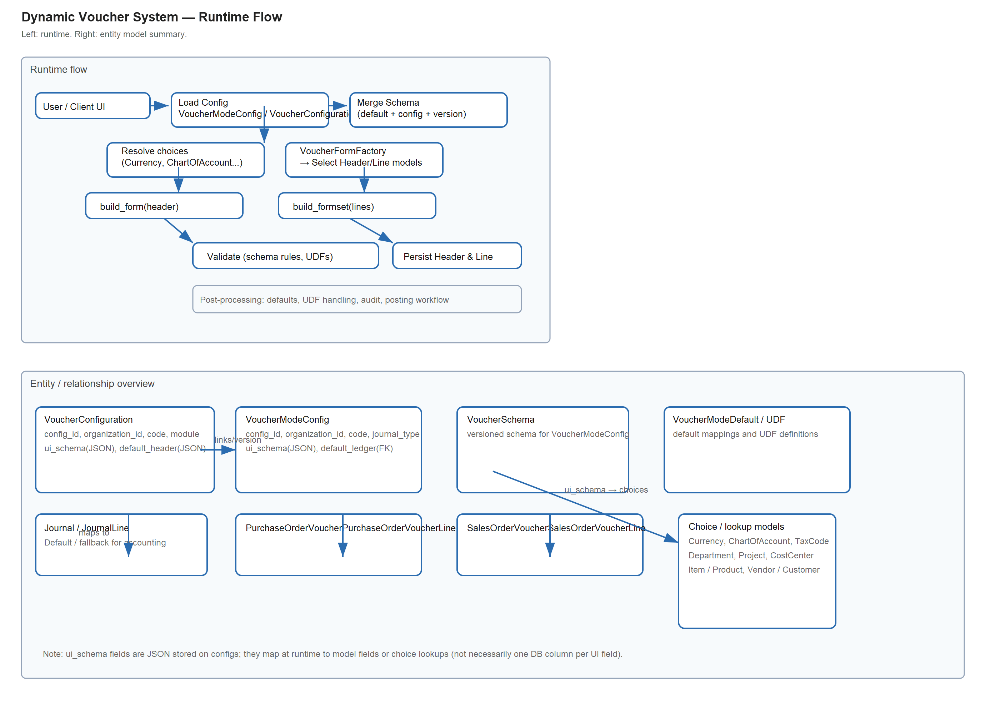
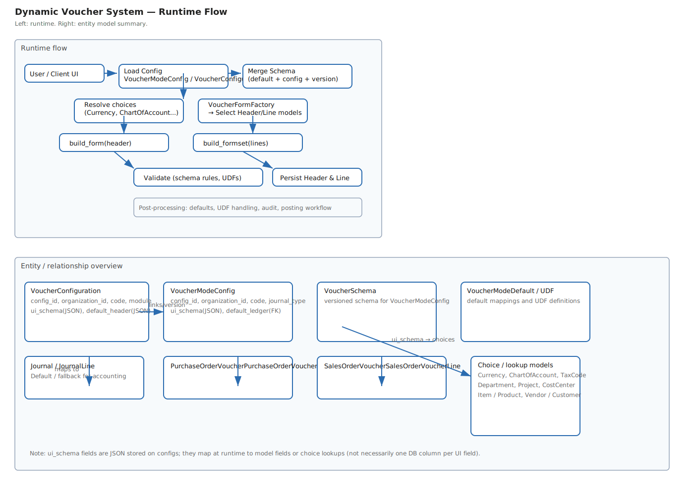

# Dynamic Voucher System Documentation

## Overview

The Dynamic Voucher System provides a configuration-driven approach to creating and managing voucher forms across different modules (Accounting, Purchasing, Sales, Inventory). This system allows for flexible form generation based on JSON schemas stored in database configurations.

The system has evolved with two implementations:

1. **Legacy Implementation**: Uses `VoucherConfiguration` models in the accounting app
2. **New Implementation**: Uses the dedicated `voucher_config` app with isolated models and HTMX-powered UI

## Architecture

### Core Components

1. **Configuration Models**: Store form schemas, UI configurations, and metadata
2. **Schema Builder**: `resolve_ui_schema()` methods generate UI schemas from configurations
3. **Form Factory**: Schema-based form generation in `forms_factory.py`
4. **HTMX UI**: Dynamic endpoints for real-time interactions (new implementation)

### Key Features

- **Module-based Model Mapping**: Automatic mapping of configurations to appropriate Django models
- **Schema-driven Forms**: Forms generated from JSON schemas in `ui_schema` field
- **Multiple Configuration Support**: Handles multiple configurations per (module, code) pair
- **Fallback Mechanisms**: Graceful fallbacks for unknown configurations
- **HTMX Integration**: Real-time UI updates without page reloads (new implementation)

## Model Mappings

### Header Models

| Module | Code | Header Model | Line Model |
|--------|------|--------------|------------|
| accounting | * | Journal | JournalLine |
| purchasing | purchase_order | PurchaseOrderVoucher | PurchaseOrderVoucherLine |
| purchasing | purchase_return | PurchaseReturnVoucher | PurchaseReturnVoucherLine |
| sales | sales_order | SalesOrderVoucher | SalesOrderVoucherLine |
| inventory | * | Journal | JournalLine |
| * | * | Journal | JournalLine (fallback) |

## New Implementation (voucher_config App)

### Models

- **VoucherConfigMaster**: Core configuration with schema resolution
- **InventoryLineConfig**: Line item grid configuration
- **FooterChargeSetup**: Tax and charge calculations
- **VoucherUDFConfig**: User-defined fields

### Services

- **DraftService**: Atomic draft save operations
- **PostingOrchestrator**: Integration with accounting posting workflow

### Views

HTMX-powered endpoints for:
- Voucher selection (`/voucher-config/select/`)
- Dynamic form creation (`/voucher-config/new/<code>/`)
- Real-time validation (`/voucher-config/validate/`)
- Draft saving (`/voucher-config/draft/`)
- Line item management (`/voucher-config/add-line/`)

### Templates

Modular HTMX templates in `voucher_config/templates/` supporting partial updates for header, lines, totals, and status tracking.

## Legacy Implementation (Accounting App)

### Creating Forms

```python
from accounting.forms.form_factory import VoucherFormFactory
from accounting.models import VoucherConfiguration

# Get configuration
config = VoucherConfiguration.objects.get(module='purchasing', code='purchase_return')

# Create form
form = VoucherFormFactory.get_generic_voucher_form(config, organization)

# Create formset
formset = VoucherFormFactory.get_generic_voucher_formset(config, organization)
```

### Form Schema Structure

The `ui_schema` field in VoucherConfiguration contains:

```json
{
  "header": [
    {
      "name": "supplier",
      "type": "select",
      "label": "Supplier",
      "choices": "Vendor",
      "required": true
    },
    {
      "name": "narration",
      "type": "textarea",
      "label": "Narration",
      "required": false
    }
  ],
  "lines": [
    {
      "name": "item",
      "type": "select",
      "label": "Item",
      "choices": "Item",
      "required": true
    },
    {
      "name": "quantity",
      "type": "number",
      "label": "Quantity",
      "required": true
    }
  ]
}
```

### Field Types Supported

- `text`: CharField with TextInput
- `textarea`: TextField with Textarea
- `number`: DecimalField with NumberInput
- `date`: DateField with DateInput
- `select`: ModelChoiceField with Select (supports model references)
- `checkbox`: BooleanField with CheckboxInput

## API Reference

### VoucherFormFactory Methods

#### `get_generic_voucher_form(voucher_config, organization, **kwargs)`

Creates a ModelForm for the voucher header.

**Parameters:**
- `voucher_config`: VoucherConfiguration instance
- `organization`: Organization instance
- `**kwargs`: Additional form kwargs (instance, data, files, etc.)

**Returns:** ModelForm class configured for the voucher type

#### `get_generic_voucher_formset(voucher_config, organization, **kwargs)`

Creates a FormSet for voucher lines.

**Parameters:**
- `voucher_config`: VoucherConfiguration instance
- `organization`: Organization instance
- `**kwargs`: Additional formset kwargs (instance, data, files, etc.)

**Returns:** FormSet class configured for the voucher type

#### `_get_model_for_voucher_config(voucher_config)`

Gets the appropriate Django model for a configuration.

**Parameters:**
- `voucher_config`: VoucherConfiguration instance

**Returns:** Django Model class

#### `_get_line_model_for_voucher_config(voucher_config)`

Gets the appropriate line Django model for a configuration.

**Parameters:**
- `voucher_config`: VoucherConfiguration instance

**Returns:** Django Model class

## Testing

Run the test suite:

```bash
python manage.py test accounting.tests.test_dynamic_vouchers
```

### Test Coverage

- Model mappings for all supported modules
- Form creation and validation
- Formset creation and validation
- Schema field validation
- Duplicate configuration handling
- Fallback mechanisms
- Integration workflows

## Configuration Management

### Creating New Voucher Configurations

1. Create VoucherConfiguration instance
2. Define `ui_schema` with header and lines schemas
3. Set appropriate module and code
4. The system will automatically map to correct models

### Adding New Modules

1. Update model mapping logic in `VoucherFormFactory._get_model_for_voucher_config()`
2. Update line model mapping in `VoucherFormFactory._get_line_model_for_voucher_config()`
3. Add corresponding test cases

### Schema Validation

Form schemas are validated at runtime. Invalid schemas may cause form creation failures.

## Troubleshooting

### Common Issues

1. **UnboundLocalError**: Check that `from django.apps import apps` is imported at method start
2. **FieldError**: Verify model has `is_active` field or update forms_factory.py
3. **LookupError**: Check that referenced models exist in the app registry
4. **KeyError**: Verify `ui_schema` contains 'header' and 'lines' keys

### Debug Steps

1. Check VoucherConfiguration exists and has valid ui_schema
2. Verify model mappings return correct Django models
3. Test form creation with minimal schema
4. Check Django debug logs for detailed errors

## Future Enhancements

- **Custom Field Types**: Extend schema support for custom widgets
- **Validation Rules**: Schema-based validation rules
- **Conditional Fields**: Show/hide fields based on other field values
- **Bulk Operations**: Support for bulk voucher creation
- **Template System**: Reusable form templates
- **Audit Trail**: Track configuration changes
- **Performance**: Caching for frequently used configurations

## Diagrams

An SVG diagram summarizing runtime flow and model relationships is included in the repository:



_Vector source:_ 

You can also view/edit the Mermaid sources used for design in this file; the diagram shows config lookup, schema merging, form building, model mapping, validation, persistence and related models.