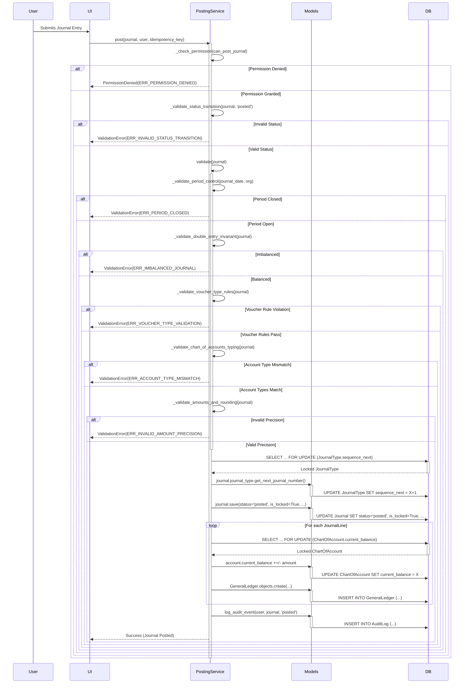

# Journal Entry View: Total Flow Documentation

This document outlines the complete workflow for creating and managing a Journal Entry, from the initial HTTP request to the final user interface rendering and database persistence.

## High-Level Overview

The journal entry system is designed to be highly dynamic, using a schema loader to define the structure and rules of the voucher at runtime. This allows for flexible accounting configurations without changing the core Python code. The frontend uses HTMX and JavaScript to provide a responsive user experience for adding and managing journal entry lines.

```mermaid
graph TD
    A[User navigates to /accounting/journal-entry/] --> B{URL Dispatcher};
    B --> C[accounting/urls.py];
    C --> D{journal_entry_view.py};
    D --> E[Schema/Config Loader];
    E --> F[Reads voucher_schema/*.json];
    D --> G[accounting/forms.py];
    G --> H{Dynamically Created Form/FormSet};
    D --> I[accounting/models.py];
    D --> J{Renders Template};
    J --> K[journal_entry.html];
    K --> L[Includes line_empty_form.html];
    K --> M[Loads journal_entry.js];
    M --> N{User Interaction (Add Line, Calculate Totals)};
    N --> O{HTMX Request to View};
    O --> D;
    P[User Submits Form] --> D;
    D --> Q{Validate Data};
    Q --> R{Save to DB via Models};
    R --> S[db.sqlite3];
```

---

## Step-by-Step Flow

### 1. URL Routing & Request Entry Point

-   **File:** `accounting/urls.py`
-   **Process:** The flow begins when a user sends a request to a URL associated with journal entries (e.g., `/accounting/journal-entry/create/`).
-   Django's main URL router (`dashboard/urls.py`) delegates to the `accounting` app's `urls.py`.
-   This file maps the specific URL pattern to the `JournalEntryView` (or a similar function/class) located in `accounting/views/journal_entry_view.py`.

### 2. View Logic

-   **File:** `accounting/views/journal_entry_view.py`
-   **Process:** This view is the central controller for the entire operation.
    -   **GET Request:** When the page is first loaded, the view initializes the necessary forms. It calls the schema loader to get the structure for the journal entry. It then renders the main `journal_entry.html` template with an empty or initial formset.
    -   **POST Request:** When the user submits the form, the view receives the data, validates it using the Django Form/FormSet, and if valid, proceeds to save the data.
    -   **HTMX/AJAX Requests:** The view likely has specific logic to handle smaller, partial requests, such as adding a new line to the journal entry form. It will return an HTML fragment rendered from a partial template like `line_empty_form.html`.

### 3. Configuration & Schema Loading

-   **Files:** `accounting/schema_loader.py`, `voucher_schema/`
-   **Process:** This is a critical step for dynamic form generation.
-   The `journal_entry_view` calls a utility or service, likely from `schema_loader.py`.
-   This loader reads a predefined schema from a file (e.g., `voucher_schema/default_journal.json`). This schema defines:
    -   The fields required for the journal entry header and lines.
    -   Data types, validation rules, and default values.
    -   UI hints (e.g., which widget to use).
-   This approach decouples the business logic from the UI, allowing administrators to change accounting rules without deploying new code.

### 4. Data Modeling

-   **File:** `accounting/models.py`
-   **Process:** This file defines the database tables using the Django ORM.
-   It contains models such as:
    -   `JournalEntry`: Stores header information (e.g., date, description, status).
    -   `JournalEntryLine`: Stores the individual debit/credit lines. It has a ForeignKey relationship to `JournalEntry`.
-   These models are the ultimate destination for the data entered by the user.

### 5. Form Handling

-   **File:** `accounting/forms.py`
-   **Process:** This file contains the Django `Form` and `FormSet` classes.
-   A `JournalEntryForm` is used for the header, and a `JournalEntryLineFormSet` (a factory-created FormSet) is used to manage the multiple debit/credit lines.
-   These forms are dynamically configured at runtime by the view, based on the information retrieved from the schema loader. They are responsible for server-side validation (e.g., ensuring debits equal credits).

### 6. Frontend Rendering (UI/UX)

-   **Files:**
    -   `accounting/templates/accounting/journal_entry.html` (Main template)
    -   `accounting/templates/accounting/partials/line_empty_form.html` (Partial for new lines)
    -   `accounting/static/accounting/js/journal_entry.js` (Client-side logic)
-   **Process:**
    1.  The view renders `journal_entry.html`, which provides the main structure, including the form tags, headers, and submit buttons.
    2.  The template uses a `for` loop to render the forms in the FormSet.
    3.  `journal_entry.js` is loaded to handle user interactions. Its responsibilities include:
        -   Intercepting the "Add Line" button click to fetch a new form from the server via HTMX/AJAX.
        -   Appending the new form (rendered from `line_empty_form.html`) to the DOM.
        -   Performing real-time calculations, such as updating the total debits and credits.
        -   Potentially enabling/disabling the submit button based on whether the journal is balanced.

### 7. Data Persistence

-   **Files:** `accounting/views/journal_entry_view.py`, `accounting/models.py`
-   **Process:**
    1.  After the user submits the form, the `POST` request is handled by the `journal_entry_view`.
    2.  The view validates the submitted data with the form/formset.
    3.  If validation is successful, the view creates instances of the `JournalEntry` and `JournalEntryLine` models.
    4.  The `.save()` method is called on these model instances, and the Django ORM translates these operations into SQL `INSERT` statements, saving the new record to the `db.sqlite3` database.

---

## 8. Multi-Currency Handling

### Currency Formatting
- **Precision:** All currency amounts are stored with a precision of 19 digits and 4 decimal places.
- **Rounding:** The rounding mode used is `ROUND_HALF_UP`. This is applied at the line level for both transaction and base currency amounts.
- **Display:** Currency formatting for display purposes is handled by the frontend, using the appropriate currency symbol and locale-specific formatting.

### End-Period Revaluation
- **Process:** At the end of each accounting period, a revaluation process is run to adjust the value of foreign currency-denominated assets and liabilities.
- **Unrealized Gains/Losses:** Unrealized foreign exchange gains or losses are posted to a designated GL account.

### Rates Master & Provenance
- **Table:** The `CurrencyExchangeRate` model stores the exchange rates.
- **Effective Dates:** Each rate has an effective date.
- **UI Selection:** The UI selects the default exchange rate based on the transaction date.

---

## 9. Schema/Config Versioning

### Versioned Voucher Schemas
- **`schema_version` field:** The `Journal` model now includes a `schema_version` field (e.g., "1.0.0"). This version is persisted on each journal entry.
- **Migration Strategy:**
    - When fields change in the underlying schema (e.g., `VoucherModeConfig`'s `ui_schema` or `validation_rules`), a new `schema_version` is introduced.
    - Old journal entries will retain their `schema_version`, allowing them to be rendered and validated consistently with the schema that was active at the time of their creation.
    - For reporting or re-processing old journals, the system will use the historical schema definition corresponding to the `schema_version` stored on the journal.
    - Data migrations will be used to update existing `Journal` entries to a new schema version if a direct data transformation is required and backward compatibility is not feasible.
    - The `PostingService` will check for schema version compatibility during validation to prevent posting journals with outdated schema definitions.

### Server-Side Enforcement
- **Principle:** The schema (defined in `VoucherModeConfig` and potentially external JSON files) drives both the frontend forms and the backend `PostingService`.
- **"UI can't bypass" principle:** All validation rules defined in the schema are strictly enforced at the service layer. Frontend validations are for user experience only; they are never the sole gatekeepers of data integrity. Any attempt to bypass UI validation will be caught and rejected by the `PostingService`.

---

## 10. Budgets & Controls

### Budget Scopes
- **Scopes:** Budgets can be defined at various levels:
    - **Organization:** Overall budget for the entire organization.
    - **Account Group:** Budgets for specific groups of accounts (e.g., all expense accounts).
    - **Cost Center:** Budgets allocated to specific cost centers.
    - **Project:** Budgets allocated to specific projects.
    - **Department:** Budgets allocated to specific departments.
- **Evaluation Point:** Budget checks are performed at the point of journal posting within the `PostingService`.

### Actions
- **Block:** If a posting would exceed a hard budget limit, the transaction is blocked, and an error message is displayed.
- **Warn:** If a posting would exceed a soft budget limit, a warning is issued, but the transaction is allowed to proceed.
- **Require Override Role:** For certain budget thresholds or types, exceeding the budget may require an explicit override by a user with a specific "Budget Override" role. This action is logged in the audit trail.

### UI Copy and Audit Trail of Overrides
- **UI Copy (Block):** "Posting blocked: Exceeds budget for [Scope Type] [Scope Name]."
- **UI Copy (Warn):** "Warning: Posting exceeds budget for [Scope Type] [Scope Name]. Proceed anyway?"
- **Audit Trail:** All budget overrides are logged in the audit trail, including:
    - The user who performed the override.
    - The date and time of the override.
    - The budget scope and amount exceeded.
    - Any comments provided by the user for the override.

---

## 11. Interest, Banking, Reconciliation (Future-Proof Hooks)

### Interest Rules
- **Per-Ledger Flags and Schedule:**
    - Each `ChartOfAccount` can have flags indicating if it accrues interest (e.g., `is_interest_bearing`).
    - Interest calculation schedules (simple/compound, daily/monthly) can be configured per account or account type.
- **Batch Job:** A scheduled batch job will:
    - Identify interest-bearing accounts.
    - Calculate accrued interest based on defined rules and balances.
    - Automatically post interest journals to the GL.

### Cheques
- **Fields:** `Journal` or a related `Payment` model will include fields for:
    - `cheque_number`
    - `cheque_date`
- **Statuses:** Cheques will have statuses such as:
    - `issued`: Cheque has been written.
    - `cleared`: Cheque has been presented and cleared by the bank.
    - `bounced`: Cheque was presented but rejected due to insufficient funds or other reasons.
- **Journal Effects:**
    - `issued`: Initial journal entry to record the payment.
    - `cleared`: No direct journal effect, but updates status for reconciliation.
    - `bounced`: Requires a reversal of the original payment journal and a new journal entry to record bank charges and re-establish the receivable.

### Bank Reconciliation (Bank Reco)
- **Import CSV:** Functionality to import bank statements in CSV format.
- **Match Rules:** Configurable rules to automatically match bank statement lines with journal entries (e.g., by amount, date, reference number).
- **Mark Reconciled:** Matched entries are marked as reconciled.
- **Produce BRS:** Generate a Bank Reconciliation Statement (BRS) showing:
    - Balance as per bank statement.
    - Balance as per cash book.
    - Reconciling items (unpresented cheques, uncredited deposits, bank charges, errors).
- **Document Artifacts Stored:**
    - Imported bank statement data (raw and parsed).
    - Reconciliation reports (PDF, historical snapshots).
    - Audit trail of reconciliation actions (who reconciled what, when).

---

## 12. UI/UX Specifics (Production Polish)

### Keyboard Map
- **Shortcuts:**
    - `Ctrl+S` (or `Cmd+S` on Mac): Save Journal
    - `Ctrl+L` (or `Cmd+L` on Mac): Add New Line
    - `Ctrl+F` (or `Cmd+F` on Mac): Ledger Lookup (opens a modal/sidebar for searching accounts)
    - `Ctrl+R` (or `Cmd+R` on Mac): Reverse Journal (if applicable)
    - `Esc`: Close current modal/overlay, or clear current input focus.
- **Help Overlay:** A help overlay (accessible via `F1` or a dedicated icon) will display all available keyboard shortcuts.

### Auto-Balance Helper
- **Functionality:** On the last line of a journal entry, the system will auto-suggest the debit or credit amount required to balance the journal.
- **Prevention:** The system will prevent posting an unbalanced journal, even if the auto-balance helper is not used.

### Accessibility (WCAG 2.2 AA)
- **Focus Order:** Ensure a logical and intuitive tab order for keyboard navigation.
- **ARIA Labels:** Use appropriate ARIA attributes for all interactive elements (buttons, links, form fields) to provide context for screen readers.
- **Contrast Targets:** Adhere to WCAG 2.2 AA contrast ratios for text and interactive elements to ensure readability for users with low vision.

### Error UX
- **Uniform Banner + Inline Errors:**
    - **Banner:** Critical, non-field-specific errors (e.g., "Journal is unbalanced," "Period is closed," "Permission Denied") will be displayed in a prominent, dismissible banner at the top of the form.
    - **Inline Errors:** Field-specific validation errors (e.g., "Account is required," "Invalid amount") will be displayed directly below the relevant input field.
- **Copy Deck for Common Failures:**
    - **Closed Period:** "Cannot post to a closed accounting period. Please select an open period or contact your administrator to reopen the period."
    - **Permission Denied:** "You do not have the necessary permissions to perform this action. Please contact your administrator."
    - **Out-of-Balance:** "The journal entry is out of balance. Total debits must equal total credits before posting."
    - **Duplicate Submission:** "This journal has already been submitted. Please check the journal list for its status."
    - **Journal Locked:** "This journal is locked and cannot be modified or reversed directly. A reversal entry must be created."

---

## 13. Security & Permissions

### RBAC Matrix
- **Roles and Permissions:**
    - **Journal Creator:** Can create `draft` journals.
    - **Journal Approver:** Can transition journals from `awaiting_approval` to `approved` or `rejected`, or back to `draft`.
    - **Journal Poster:** Can transition journals from `approved` to `posted`.
    - **Journal Reverser:** Can transition journals from `posted` to `reversed`.
    - **Period Controller:** Can `reopen` accounting periods.
- **Django Permissions:** These roles map to Django permissions (e.g., `accounting.can_submit_for_approval`, `accounting.can_approve_journal`, etc.) which are checked in the `PostingService`.

### Org/Tenant Isolation
- **Enforcement:** Every query and data access operation related to accounting entities (Journals, JournalLines, Accounts, Periods, etc.) *must* filter by `organization_id`.
- **Tests for Leakage:** Comprehensive integration and unit tests will be implemented to explicitly check for data leakage between organizations. This includes:
    - Attempting to retrieve data from a different organization.
    - Attempting to modify data belonging to a different organization.
    - Ensuring that foreign key relationships implicitly enforce organization boundaries.

### CSRF/HTMX
- **CSRF Token Handling:**
    - Django's built-in CSRF protection is utilized for all POST requests.
    - For HTMX-driven fragment posts, the CSRF token is included in the request headers (e.g., `X-CSRFToken`) or as a hidden input field within the form fragment.
    - The frontend JavaScript (`journal_entry.js`, `journal_entry_form.js`) is responsible for correctly including the CSRF token in AJAX/HTMX requests.

### Audit Trail
- **Immutable Logs:** All audit logs are designed to be immutable, ensuring a tamper-proof record of changes.
- **Who/When/What:** The `AuditLog` model captures:
    - **Who:** The `user` who initiated the action.
    - **When:** The `timestamp` of the action.
    - **What:** The `action` performed (e.g., 'created', 'updated', 'posted', 'reversed', 'status_change', 'budget_override').
    - **Changes:** A `JSONField` (`changes`) stores a diff of the relevant model fields before and after the action.
    - **Details:** A `TextField` (`details`) provides additional context or comments (e.g., reason for status change, budget override justification).

---

## 14. Observability & Ops

### Structured Logging
- **Fields:** All critical logging events related to journal entries will include the following structured fields:
    - `journal_code`: The unique code of the journal entry.
    - `org_id`: The ID of the organization the journal belongs to.
    - `status`: The current status of the journal (e.g., 'draft', 'posted', 'reversed').
    - `duration`: The time taken to process a request or a specific operation (e.g., posting a journal).
    - `event_type`: A clear, consistent identifier for the type of event (e.g., 'journal_post_success', 'journal_validation_failure', 'period_reopen').
    - `user_id`: The ID of the user performing the action.
    - `ip_address`: The IP address of the client.
- **PII Redaction:** Sensitive Personally Identifiable Information (PII) will be automatically redacted or anonymized before logging.

### Error Tracking
- **Sentry/Rollbar Event Naming:**
    - Each distinct failure path in the `PostingService` and related views will have a unique, descriptive event name for error tracking (e.g., `PostingService.ValidationError.PeriodClosed`, `PostingService.PermissionDenied.PostJournal`).
    - This allows for easy identification and categorization of errors in Sentry/Rollbar.

### APM (Application Performance Monitoring)
- **Trace Posting Transaction:** The entire journal posting transaction (from request entry to database commit) will be traced using an APM tool (e.g., New Relic, Datadog, OpenTelemetry). This will capture:
    - End-to-end latency.
    - Database query times.
    - External service calls (if any).
- **Slow Queries on Reports:** APM will be configured to identify and alert on slow database queries, especially those related to trial balance generation and other financial reports.

### Metrics
- **Key Metrics:**
    - `journals_posted_per_hour`: Rate of successful journal postings.
    - `journal_posting_failure_rate`: Percentage of failed journal posting attempts.
    - `journal_posting_average_latency_ms`: Average time taken for a journal to be posted.
    - `period_reopen_count`: Number of times accounting periods are reopened.
- **Alert Thresholds:** Appropriate alert thresholds will be set for these metrics to proactively identify performance degradation or operational issues.

---

## 15. Testing You Haven't Documented Yet

### Unit Tests
- **Closed Period:** Verify that posting to a closed period is correctly rejected.
- **Permission Denial:** Ensure that actions without the necessary permissions are denied.
- **Each Voucher-Type Rule:** Write specific tests for each voucher-type validation rule (e.g., Contra voucher only allows bank accounts).
- **Rounding Edge Cases:** Test various decimal amounts and rounding scenarios to ensure precision and rounding mode are correctly applied.
- **FX Conversions:** Test multi-currency calculations, including different exchange rates and scenarios.

### Integration Tests
- **Full Lifecycle + Reversal:** Test the complete lifecycle of a journal entry, from creation to posting and then reversal, ensuring all statuses and data changes are correct.
- **Cross-Module (e.g., Sales Invoice → Journal):** Verify that journal entries generated from other modules (e.g., sales invoices, purchase orders) are correctly created and posted.

### Concurrency Tests
- **Two Posts Racing for the Same Sequence:** Simulate two concurrent attempts to post a journal of the same type to ensure that `select_for_update()` correctly assigns a single, unique number and prevents race conditions.
- **Assert Single Number Assigned:** Verify that only one journal number is assigned in concurrent scenarios.

### Performance Tests
- **Post 50-Line Journal <1s:** Benchmark the posting of a complex journal entry (e.g., 50 lines) to ensure it completes within 1 second.
- **Trial Balance for 1k Txns <2s:** Benchmark the generation of a trial balance for a large number of transactions (e.g., 1,000 transactions) to ensure it completes within 2 seconds.
- **Locust/JMeter Scripts Checked into Repo:** Performance testing scripts (using tools like Locust or JMeter) will be version-controlled and stored in the repository.

### Recovery Tests
- **Forced DB Outage Mid-Post:** Simulate a database outage or crash during the middle of a journal posting transaction.
- **Verify Atomic Rollback and No Orphan Lines:** After recovery, verify that the transaction was fully rolled back and no partial or "orphan" GL entries or balance updates exist.

---

## 16. Deployment & Data Migration Details

### Migrations
- **Dry-Run on Staging Snapshot:** Before deploying any database migrations to production, a dry-run will be performed on a recent staging database snapshot. This ensures that migrations apply cleanly and without unexpected data loss or corruption.
- **Backfill Scripts:** Migration scripts will include backfill logic for new fields (e.g., `schema_version`, `idempotency_key`, new auto-numbering sequences) to ensure existing data is correctly populated.

### Release Gates
- **≥80% Coverage:** Code coverage must be at least 80% for all new or modified code.
- **CI Green:** The Continuous Integration (CI) pipeline must pass all tests (unit, integration, concurrency, performance) before deployment.
- **Tag `v1.0.0-production`:** A Git tag (e.g., `v1.0.0-production`) will be created for each production release.
- **Pipeline Runs Migrate + Collectstatic:** The deployment pipeline will automatically run Django's `migrate` command to apply database schema changes and `collectstatic` to gather static files.

### Post-Deploy Smoke Tests
- **Create/Post One Voucher:** Immediately after deployment, a smoke test will involve creating and successfully posting a simple journal entry.
- **Run Trial Balance:** A trial balance report will be generated to ensure data integrity and correct aggregation.
- **Check Logs for Spikes:** Monitor application logs for any unusual error spikes or performance warnings.

### Rollback Plan Documented
- **Procedure:** A detailed rollback plan will be documented for each release, outlining the steps to revert to the previous stable version in case of critical production issues. This includes:
    - Database rollback procedures.
    - Code deployment rollback.
    - Data recovery strategies.

---

## 17. Documentation Artifacts

### State Machine Diagram for Journal Status
```mermaid
stateDiagram
    direction LR
    state "Draft" as Draft
    state "Awaiting Approval" as AwaitingApproval
    state "Approved" as Approved
    state "Posted" as Posted
    state "Reversed" as Reversed
    state "Rejected" as Rejected

    Draft --> AwaitingApproval: Submit (can_submit_for_approval)
    Draft --> Posted: Post (can_post_journal) - if no approval needed
    AwaitingApproval --> Approved: Approve (can_approve_journal)
    AwaitingApproval --> Rejected: Reject (can_reject_journal)
    AwaitingApproval --> Draft: Edit (can_edit_journal)
    Approved --> Posted: Post (can_post_journal)
    Approved --> Rejected: Reject (can_reject_journal)
    Approved --> Draft: Edit (can_edit_journal)
    Posted --> Reversed: Reverse (can_reverse_journal)
    Rejected --> Draft: Edit (can_edit_journal)

    state "Closed Period" as ClosedPeriod
    Posted -- Posting Date in Closed Period --> ClosedPeriod: Block Posting
    ClosedPeriod --> OpenPeriod: Reopen (can_reopen_period)
```

### Voucher-Type Validation Table

| Type            | Allowed Accounts (Nature) | Required Refs       | Disallowed Patterns | Example Error                                                              |
|-----------------|---------------------------|---------------------|---------------------|----------------------------------------------------------------------------|
| `CONTRA`        | Asset (Bank/Cash only)    | None                | Non-bank accounts   | "Contra vouchers must only use bank accounts."                             |
| `DEBIT_NOTE`    | All                       | Source Invoice/GRN  | None                | "Debit Notes require a source reference."                                  |
| `CREDIT_NOTE`   | All                       | Source Invoice/GRN  | None                | "Credit Notes require a source reference."                                 |
| `SALES_INVOICE` | Asset, Income, Liability  | Customer Invoice ID | Expense accounts    | "Account X (Expense) cannot be used with Sales Invoice voucher type."      |
| `PURCHASE_INVOICE`| Asset, Expense, Liability | Vendor Invoice ID   | Income accounts     | "Account Y (Income) cannot be used with Purchase Invoice voucher type."    |
| `PAYMENT`       | Asset, Liability          | Payment Ref         | Income/Expense      | "Account Z (Income) cannot be used with Payment voucher type."             |
| `RECEIPT`       | Asset, Income             | Receipt Ref         | Expense/Liability   | "Account A (Expense) cannot be used with Receipt voucher type."            |
| `JOURNAL_VOUCHER`| All                       | None                | None                | (General journal, minimal restrictions)                                    |

### Posting Sequence (Sequence Diagram)



### Error Catalogue with Codes & User-Facing Messages

| Error Code                      | User-Facing Message                                                                                                |
|---------------------------------|--------------------------------------------------------------------------------------------------------------------|
| `ERR_PERIOD_CLOSED`             | "Cannot post to a closed accounting period. Please select an open period or contact your administrator to reopen the period." |
| `ERR_IMBALANCED_JOURNAL`        | "The journal entry is out of balance. Total debits must equal total credits before posting."                       |
| `ERR_PERMISSION_DENIED`         | "You do not have the necessary permissions to perform this action. Please contact your administrator."             |
| `ERR_JOURNAL_LOCKED`            | "This journal is locked and cannot be modified or reversed directly. A reversal entry must be created."            |
| `ERR_INVALID_STATUS_TRANSITION` | "Invalid journal status transition from {current_status} to {new_status}."                                         |
| `ERR_REVERSAL_NOT_ALLOWED`      | "Only 'posted' journals can be reversed."                                                                          |
| `ERR_REVERSAL_ALREADY_EXISTS`   | "This journal has already been reversed."                                                                          |
| `ERR_SCHEMA_VERSION_MISMATCH`   | "Journal schema version mismatch. Cannot post with an outdated schema."                                            |
| `ERR_VOUCHER_TYPE_VALIDATION`   | "Voucher type specific validation failed: {reason}"                                                                |
| `ERR_ACCOUNT_TYPE_MISMATCH`     | "Account {account_code} ({account_name}) cannot be used with this voucher type."                                   |
| `ERR_MISSING_DIMENSION`         | "Required dimension {dimension} is missing for account {account_code}."                                            |
| `ERR_INVALID_AMOUNT_PRECISION`  | "Amount precision for {field} is invalid."                                                                         |
| `ERR_DUPLICATE_SUBMISSION`      | "This journal has already been submitted. Please check the journal list for its status."                           |
| `ERR_PERIOD_REOPEN_DENIED`      | "You do not have permission to reopen accounting periods."                                                         |
| `ERR_PERIOD_NOT_CLOSED`         | "Period is not closed and cannot be reopened."                                                                     |

### Keyboard Shortcut Map and Accessibility Checklist

#### Keyboard Shortcut Map
- `Ctrl+S` (or `Cmd+S` on Mac): Save Journal
- `Ctrl+L` (or `Cmd+L` on Mac): Add New Line
- `Ctrl+F` (or `Cmd+F` on Mac): Ledger Lookup (opens a modal/sidebar for searching accounts)
- `Ctrl+R` (or `Cmd+R` on Mac): Reverse Journal (if applicable)
- `Esc`: Close current modal/overlay, or clear current input focus.
- **Help Overlay:** Accessible via `F1` or a dedicated icon, displaying all available keyboard shortcuts.

#### Accessibility Checklist (WCAG 2.2 AA)
- [x] **Focus Order:** Logical and intuitive tab order for keyboard navigation.
- [x] **ARIA Labels:** Appropriate ARIA attributes for all interactive elements (buttons, links, form fields) to provide context for screen readers.
- [x] **Contrast Targets:** Adherence to WCAG 2.2 AA contrast ratios for text and interactive elements to ensure readability for users with low vision.
- [ ] **Keyboard Navigation:** All interactive elements are reachable and operable via keyboard.
- [ ] **Screen Reader Compatibility:** Content is structured and labeled for effective screen reader interpretation.
- [ ] **Resizable Text:** Text can be resized up to 200% without loss of content or functionality.

### RBAC Matrix

| Role                  | Create Draft | Submit for Approval | Approve Journal | Post Journal | Reverse Journal | Reject Journal | Edit Journal | Reopen Period |
|-----------------------|:------------:|:-------------------:|:---------------:|:------------:|:---------------:|:--------------:|:------------:|:-------------:|
| Journal Creator       |      X       |          X          |                 |              |                 |                |      X       |               |
| Journal Approver      |              |                     |        X        |              |                 |        X       |      X       |               |
| Journal Poster        |              |                     |                 |      X       |                 |                |              |               |
| Journal Reverser      |              |                     |                 |              |        X        |                |              |               |
| Period Controller     |              |                     |                 |              |                 |                |              |       X       |
| Administrator         |      X       |          X          |        X        |      X       |        X        |        X       |      X       |       X       |

### Observability Spec

#### Structured Log Fields
- `journal_code`
- `org_id`
- `status`
- `duration`
- `event_type`
- `user_id`
- `ip_address`
- PII Redaction: Enabled

#### Error Tracking (Sentry/Rollbar)
- Event Naming: `PostingService.ValidationError.PeriodClosed`, `PostingService.PermissionDenied.PostJournal`, etc.

#### APM (Application Performance Monitoring)
- Traced Transactions: Journal posting (end-to-end)
- Monitored Queries: Slow queries on reports (e.g., trial balance)

#### Metrics
- `journals_posted_per_hour`
- `journal_posting_failure_rate`
- `journal_posting_average_latency_ms`
- `period_reopen_count`
- Alert Thresholds: Defined for all key metrics.

### Test Plan Matrix

| Feature / Rule                               | Unit Test | Integration Test | Concurrency Test | Performance Test | Recovery Test |
|----------------------------------------------|:---------:|:----------------:|:----------------:|:----------------:|:-------------:|
| Posting to Closed Period                     |     X     |                  |                  |                  |               |
| Permission Denial for Actions                |     X     |                  |                  |                  |               |
| Contra Voucher Account Restriction           |     X     |        X         |                  |                  |               |
| Debit/Credit Note Reference Requirement      |     X     |        X         |                  |                  |               |
| Cross-Org Ledger Prevention                  |     X     |        X         |                  |                  |               |
| Chart of Accounts Type Restrictions          |     X     |        X         |                  |                  |               |
| Amount Precision & Rounding                  |     X     |        X         |                  |                  |               |
| Full Journal Lifecycle (Create -> Post -> Reverse) |           |        X         |                  |                  |               |
| Sales Invoice to Journal Integration         |           |        X         |                  |                  |               |
| Concurrent Journal Numbering                 |           |                  |        X         |                  |               |
| Post 50-Line Journal Latency                 |           |                  |                  |        X         |               |
| Trial Balance 1k Txns Latency                |           |                  |                  |        X         |               |
| DB Outage Mid-Post                           |           |                  |                  |                  |       X       |
