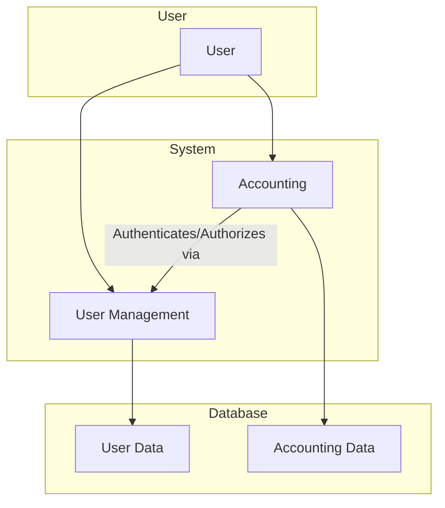

# System Architecture Overview

This document provides a high-level overview of the system architecture, focusing on the interaction between the `accounting` and `usermanagement` modules.

## High-Level Interaction Diagram

The `usermanagement` module provides the foundation for user authentication and authorization, which is consumed by the `accounting` module to control access to financial data and operations.

## Description

1.  **User Interaction**: The user interacts with both the `usermanagement` and `accounting` modules through the user interface.
2.  **Authentication and Authorization**: When a user attempts to access a protected resource in the `accounting` module, it communicates with the `usermanagement` module to verify the user's identity and permissions.
3.  **Data Segregation**: Each module is responsible for its own data. The `usermanagement` module manages user-related data, while the `accounting` module manages financial data. This separation of concerns ensures data integrity and simplifies maintenance.