# 🏗️ Himalytix ERP Architecture Documentation

**Version:** 1.0  
**Last Updated:** October 18, 2024

---

## 📋 Table of Contents
1. [System Architecture](#system-architecture)
2. [Data Flow Diagrams](#data-flow-diagrams)
3. [Deployment Architecture](#deployment-architecture)
4. [Multi-Tenancy Architecture](#multi-tenancy-architecture)
5. [API Architecture](#api-architecture)
6. [Security Architecture](#security-architecture)

---

## 🏛️ System Architecture

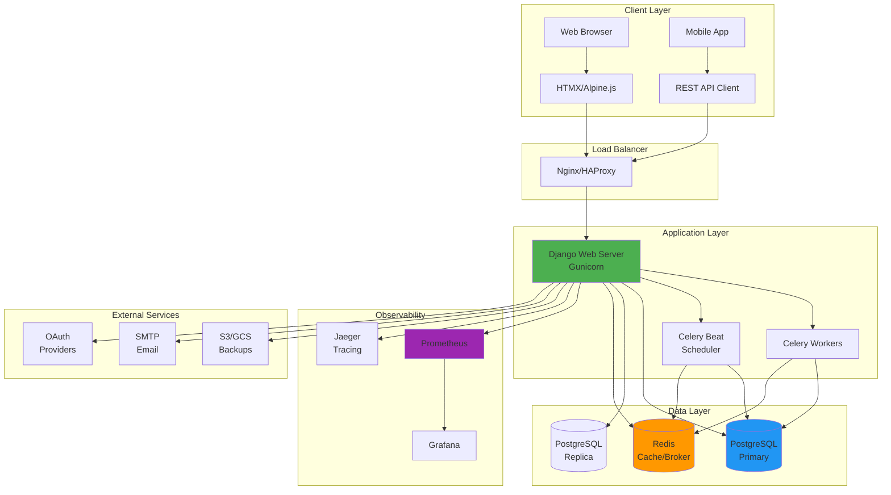

---

## 📊 Data Flow Diagrams

### 1. User Authentication Flow

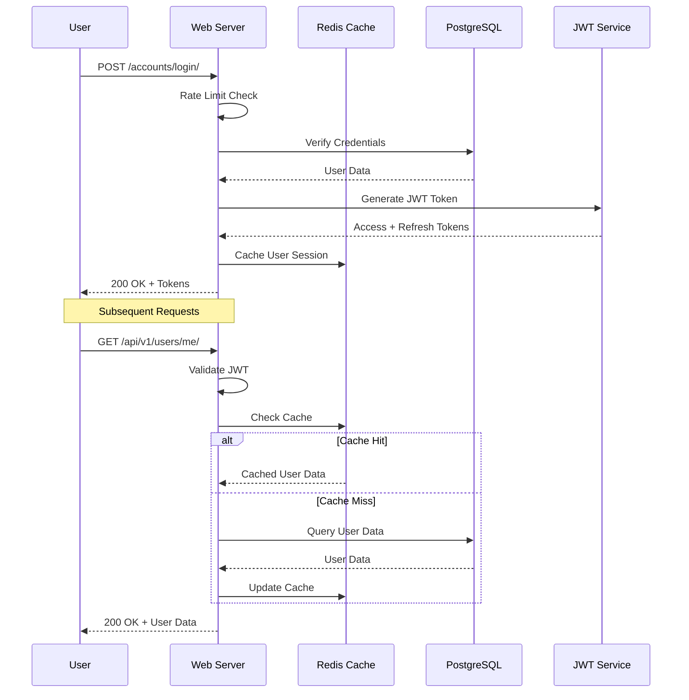

### 2. Journal Entry Creation Flow

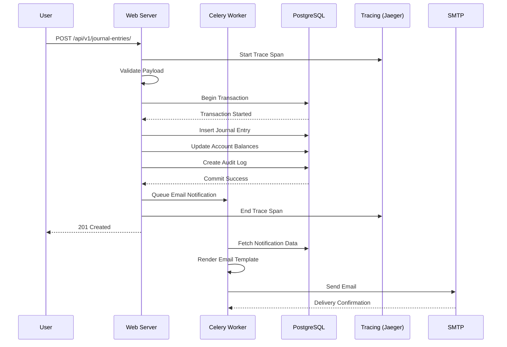

### 3. Multi-Tenant Request Flow

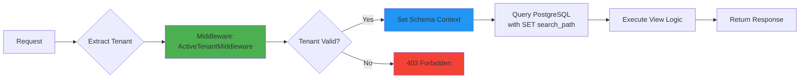

---

## 🚀 Deployment Architecture

### Production Deployment (AWS/GCP)

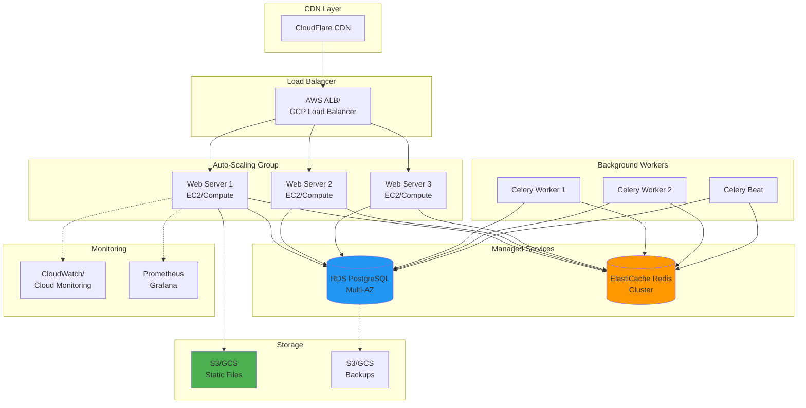

### Docker Compose Development

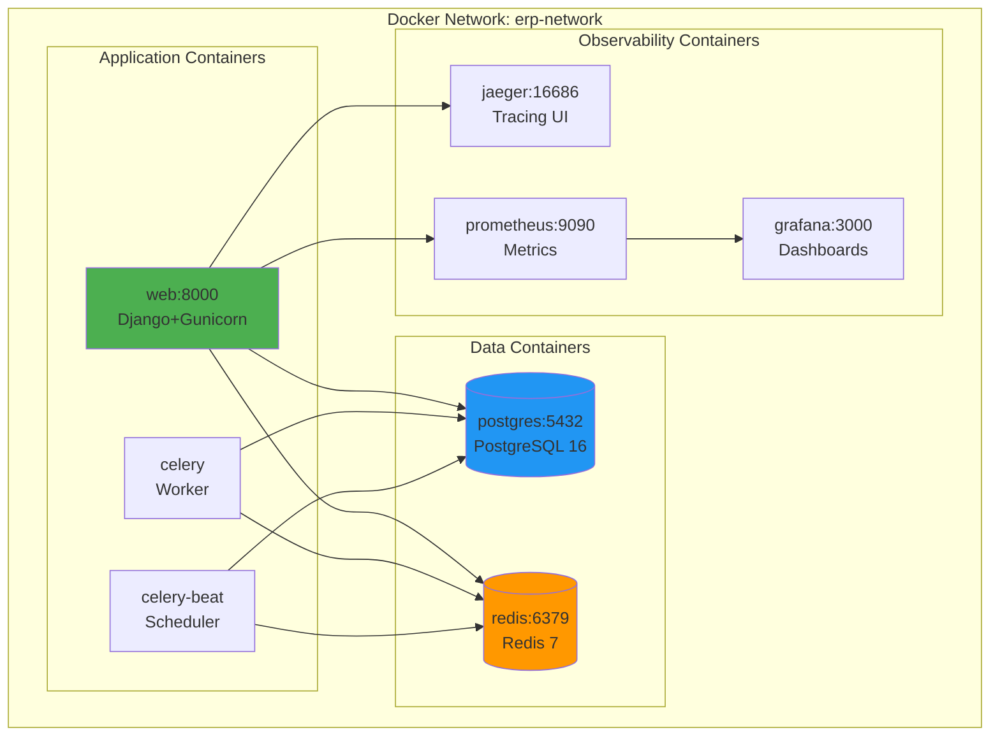

---

## 🏢 Multi-Tenancy Architecture

### Schema-per-Tenant Model

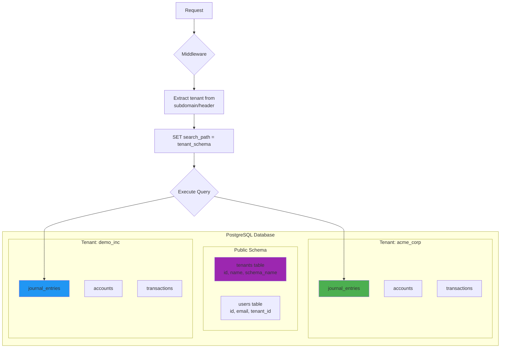

### Tenant Isolation Flow

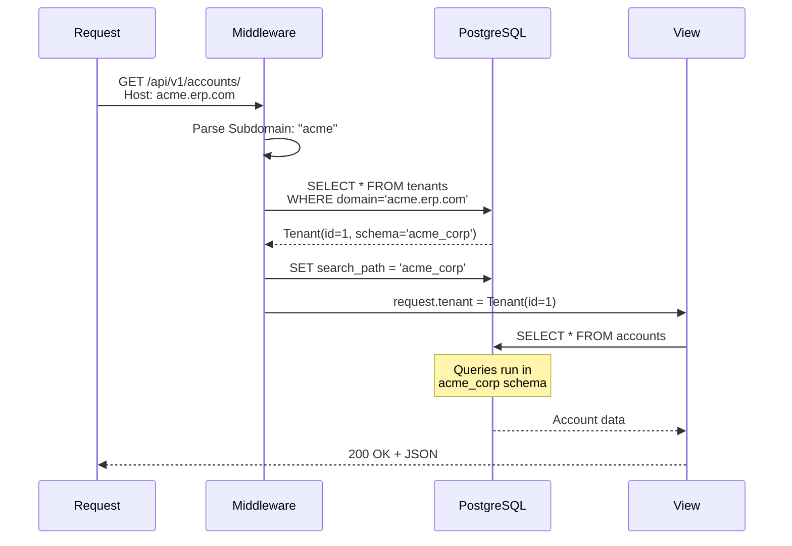

---

## 🔌 API Architecture

### RESTful API Structure

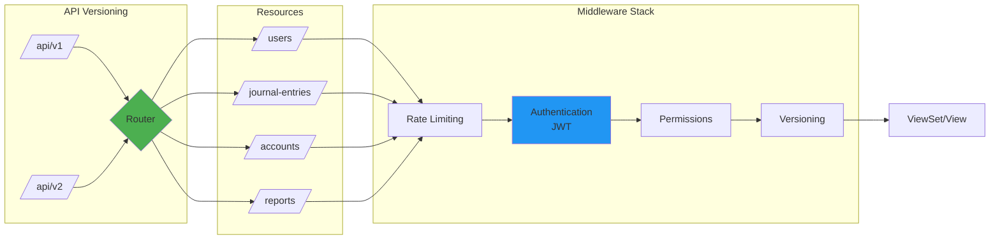

### OpenAPI Documentation Flow

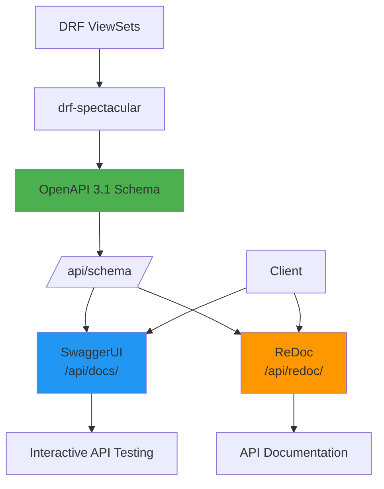

---

## 🔒 Security Architecture

### Defense in Depth

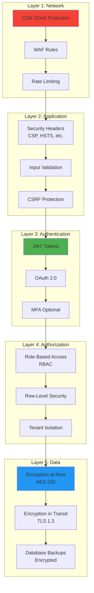

### Authentication & Authorization Flow

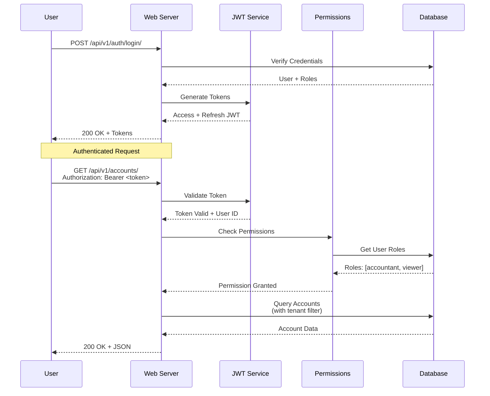

---

## 📈 Observability Architecture

### Metrics, Logs, and Traces (MLT)

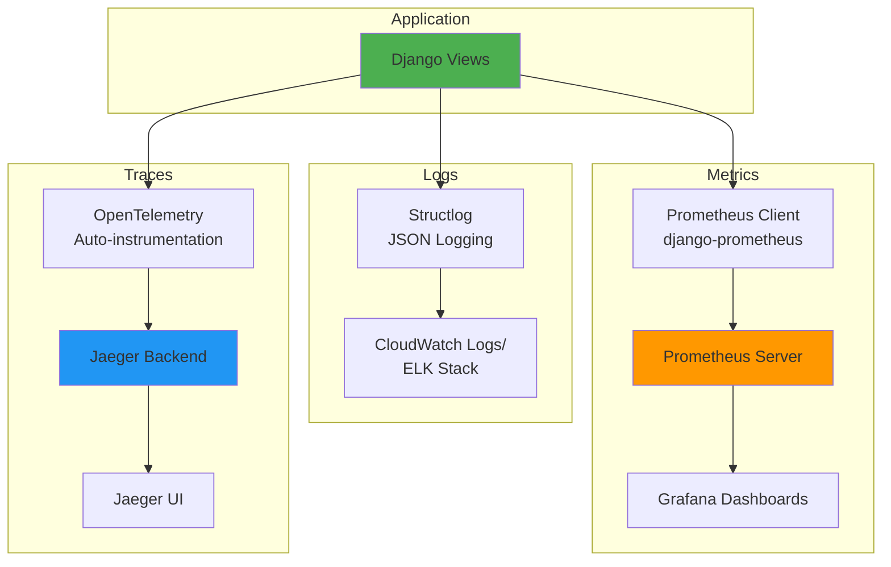

---

## 🔄 CI/CD Pipeline

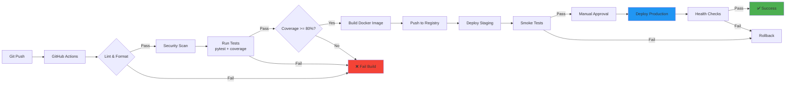

---

## 📝 Component Relationships

### Django Apps Dependency Graph

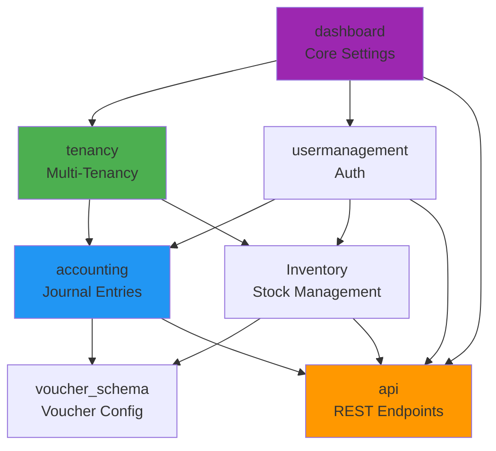

---

## 📚 Additional Resources

- [Deployment Runbook](../runbooks/deployment-rollback.md)
- [Scaling Guide](../runbooks/scaling.md)
- [Incident Response](../runbooks/incident-response.md)
- [API Migration Guide](../API_MIGRATION_v1.md)

---

**Maintained by:** DevOps Team  
**Last Review:** October 18, 2024  
**Next Review:** January 18, 2025
